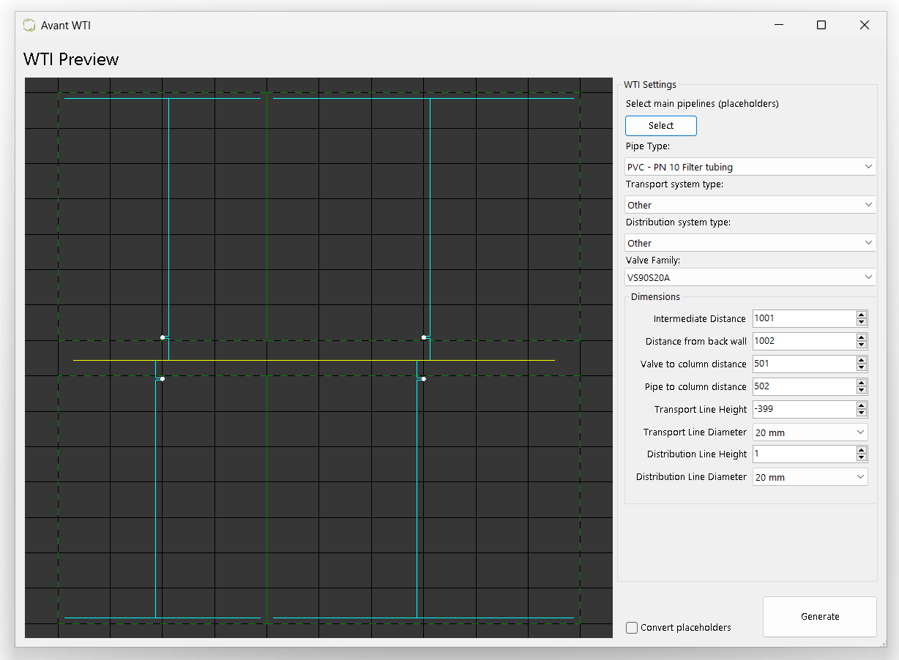
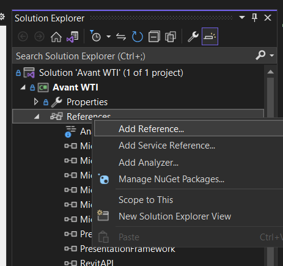
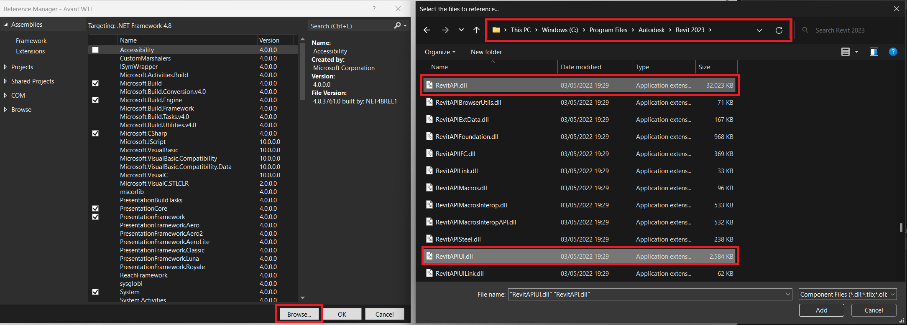
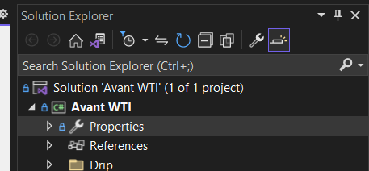
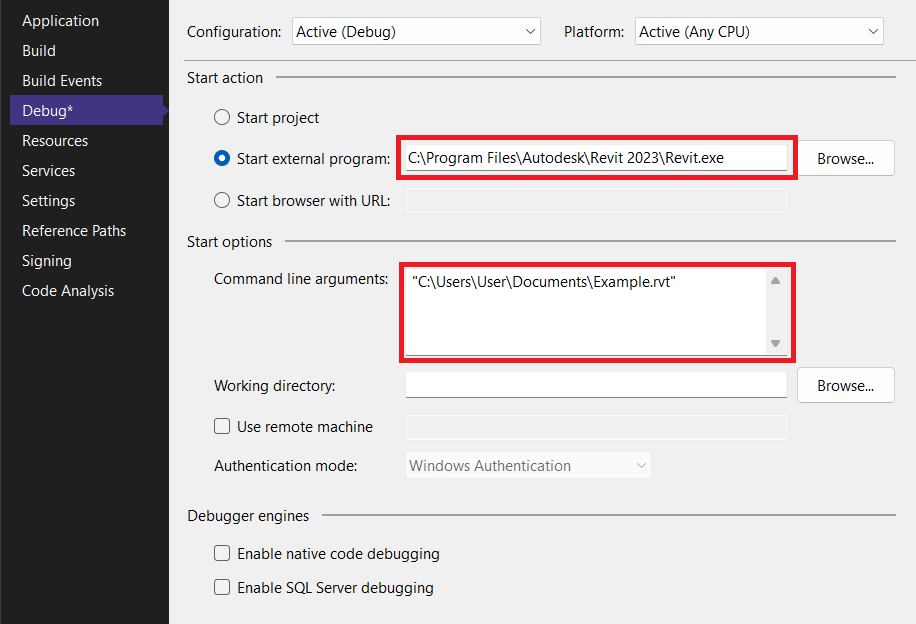
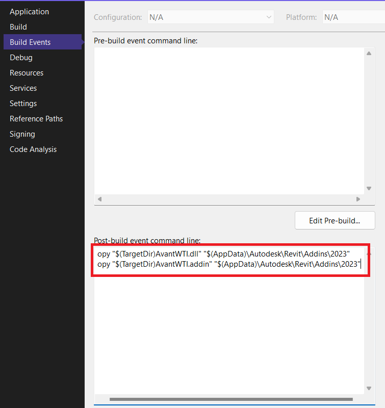

# Water Technical Installation Generator for Revit
Made by Jesse Klijnsma for [Avant Projects](https://avantprojects.nl)

## Images

## Usage

### Installation

 - Download the latest [release](/jesseklijnsma/avant-revit-wti/releases/latest)
 - Copy the contents of the zip file to '**%appdata%\\Autodesk\\Revit\\Addins**\\*year*\\'
 - (Re)Start Revit
 - Enable Add-in in popup

## Development
To make changes to the code, open the Solution in Visual Studio

**Make sure you do the following:**
 
 
Relink the Revit API References

**Setup debugging**

Double click *Properties*

 
 

Make sure the path to *Revit.exe* is correct. 
Also, set the *Command line arguments* to the path of a default project to test in.

 
To automatically copy the compiled add-in to the Revit Add-in location,

make sure this path is the same as the path used in [Installation](#installation)

